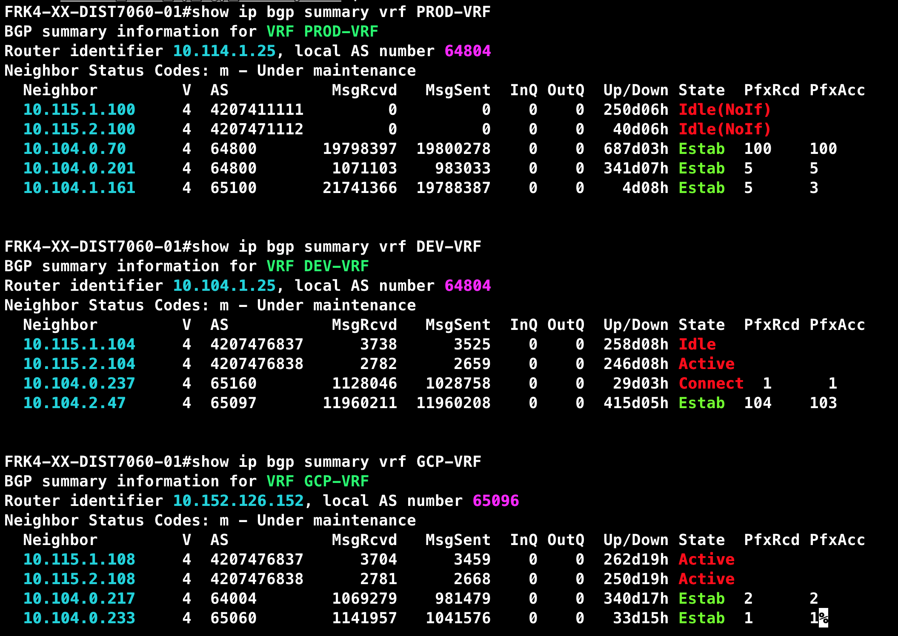
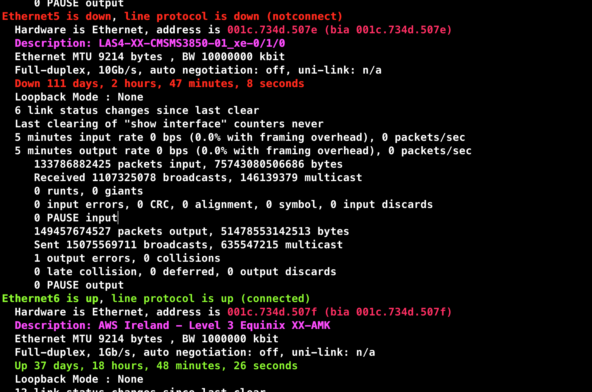
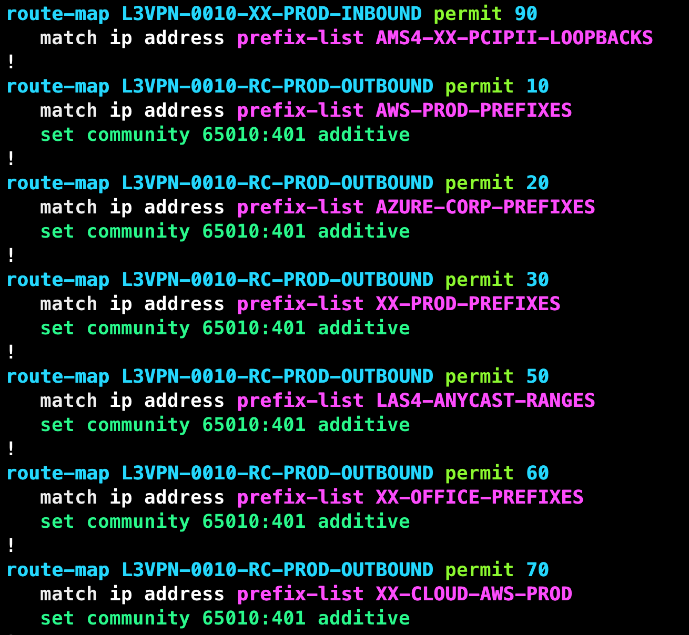
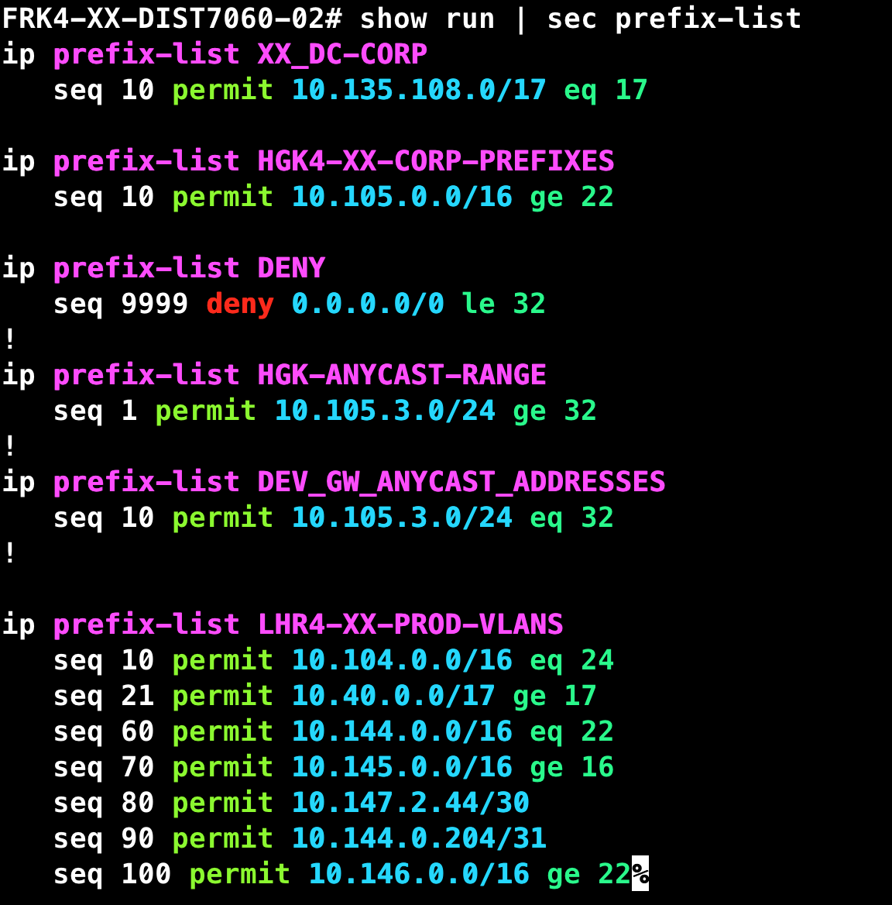

# netcli-highlight
**TLDR:** This repo will show you how to use syntax highlighting on Live Network Devices. (Juniper/Cisco/Arista)

## TOC
* [What's this about?](#what's-this-about?)
* [Use-Cases](#use-cases)
* [Benefits](#benefits)
* [Pre-requisites](#pre-requisites)
* [Usage](#usage)
* [Purpose](#purpose)
* [Limitations](#limitations)
* [Thanks](#thanks)

## What's this about?
If you have ever used the CLI on network devices, you probably have ended up frustrated trying to make sense of the long lines of configuration. Although nowadays the use of editors like `vim/Sublime/Vscode/Atmom` can provide some really useful syntax highlighting, you still can find yourself struggling to read the config files or outputs while you are on live devices.

 

**Here we have a Juniper SRX firewall policy.** This rule is comprised by `source/destination/application/actions`, if you need to read one of them it's alright but if your output has you reading over 10 rules you can see how difficult is to differentiate each component.

**Wouldn't be nice to have some live syntax highlight to differentiate each component and quickly find what you are looking for?** Something like...

If you are like me, fascinated by the concept of **marginal gains**, this guide will help you to work more efficiently in the CLI.

The purpose of this repo is to give you an idea of the power of having a syntax highlighting while working on live devices. This is not by any means a full-blown syntax highlighting solution but a way to show you how you can take advantage of it and adapt it to your needs.

**Note: The default color code has been tested using a Dark terminal Background as you can see in the images above**

## Use-cases
- Reading Firewall Rules (JunOS)

- Reading show ip bgp summary (Cisco / Arista)

- Reading show interfaces (Cisco / Arista / JunOS)

- Reading route-maps (Cisco / Arista)

- Reading Prefix lists (Cisco / Arista)

## Benefits
- Quicker troubleshooting as you can easily identify missconfigurations or things like interfaces down.

- Color codes can be totally customised to your liking. To see the available HTML color codes go [HERE](https://htmlcolorcodes.com/)
- Regex canbe customised to adapt it to  your particular Network OS (NOS) and version.

## Pre-requisites
 - Python 3.7+ Recommended
 - [Chromaterm](https://github.com/hSaria/ChromaTerm) - A big shout out to **hSaria** for buliding this wonderful tool that even work with interactive applications such as ssh.

## Usage
- Install the following package: `pip3 install chromaterm`
- Copy the config file to your home dir: `cp .chromaterm.yml ~/.chromaterm.yml`
- If you use **bash** as your shell: `echo "ssh() { /usr/bin/ssh "$@" | ct; }" > ~/.bash_profile`
- If you use **zsh** as your shell: `echo "ssh() { /usr/bin/ssh "$@" | ct; }" > ~/.zshrc`
- To test, use one of the following examples provided in the test folder. For example: `cat tests/arista_pref_list.txt | ct`
- Last, connect to a Juniper / Arista / Cisco and issue a `show interfaces`

## Limitations
- There are countless of NOS and versions so not all of them would probably work with [this config file](.chromaterm.yml) but you can easily modify it to filter the content you consider important and even customise the colors to your liking.
- [This config file](.chromaterm.yml) has been tested with a limited amount of Juniper, Cisco and Arista devices.
- For more information on the `chromaterm` config file options go [HERE](https://github.com/hSaria/ChromaTerm#highlight-rules)

## Special Thanks
Thanks to [hSaria](https://github.com/hSaria) for creating this fantastic tool [Chromaterm](https://github.com/hSaria/ChromaTerm).